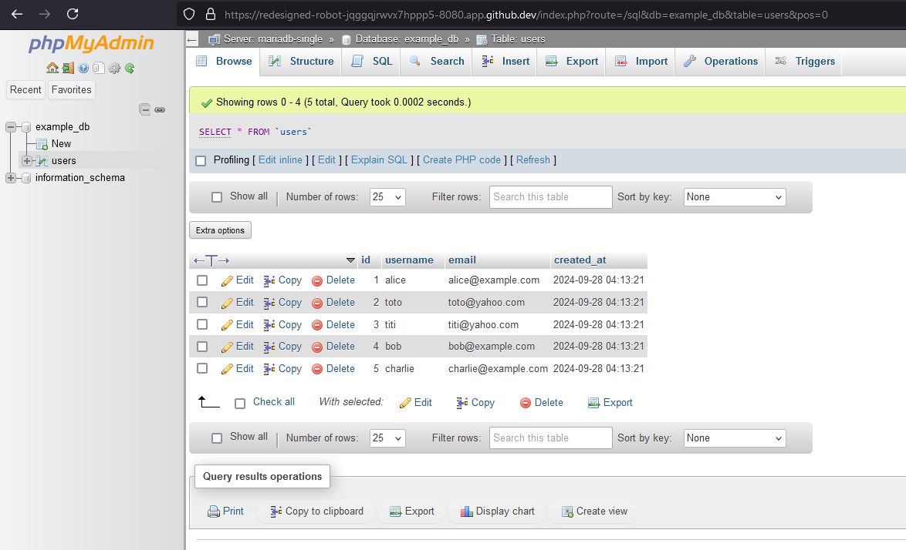

# POC MariaDB + PHPMyAdmin + Replica


## 🛠️ Comment exécuter l'architecture MariaDB + PHPMyAdmin ?

Lancer le GitHub CodeSpace associé à ce projet, aller dans le répertoire `examples/single` puis exécuter les commandes suivantes :

```bash
# Lancer les services
docker-compose -f compose-single.yml up -d

# Lister les containers
docker container ls

CONTAINER ID   IMAGE               COMMAND                  CREATED          STATUS          PORTS                                       NAMES
104c73c17d28   phpmyadmin:latest   "/docker-entrypoint.…"   10 seconds ago   Up 10 seconds   0.0.0.0:8080->80/tcp, :::8080->80/tcp       phpmyadmin
bb6b1fb12be6   mariadb:lts         "docker-entrypoint.s…"   11 seconds ago   Up 10 seconds   0.0.0.0:3306->3306/tcp, :::3306->3306/tcp   mariadb-single
```

Pour arrêter les services :

```bash
docker-compose -f compose-single.yml down

# Vérifier que les containers ont bien été arrêtés et supprimés
docker container ls -a

CONTAINER ID   IMAGE     COMMAND   CREATED   STATUS    PORTS     NAMES
```

Pour se connecter à MariaDB via un client MySQL, exécuter la commande suivante :

```bash
# Se connecter au container MariaDB avec le client SQL
docker exec -it mariadb-single mariadb mydb -ume -pchangeit

# Saisir le mot de passe

# Lister les données de la table initialisée 'users'
SELECT * FROM users;

+----+----------+---------------------+---------------------+
| id | username | email               | created_at          |
+----+----------+---------------------+---------------------+
|  1 | alice    | alice@example.com   | 2024-09-28 04:13:21 |
|  2 | toto     | toto@yahoo.com      | 2024-09-28 04:13:21 |
|  3 | titi     | titi@yahoo.com      | 2024-09-28 04:13:21 |
|  4 | bob      | bob@example.com     | 2024-09-28 04:13:21 |
|  5 | charlie  | charlie@example.com | 2024-09-28 04:13:21 |
+----+----------+---------------------+---------------------+
5 rows in set (0.001 sec)
```

Pour se connecter au container MariaDB :

```bash
# Se connecter au container MariaDB
docker exec -it mariadb-single bash

# Lister les processus
ps -ef

UID          PID    PPID  C STIME TTY          TIME CMD
mysql          1       0  0 00:25 ?        00:00:01 mariadbd
root          68       0  0 00:27 pts/0    00:00:00 bash
root          76      68  0 00:28 pts/0    00:00:00 ps -ef
```

Pour se connecter à MariaDB via PHPMyAdmin, ouvrir un navigateur web et accéder à l'URL suivante : [https://redesigned-robot-jqggqjrwvx7hppp5-8080.app.github.dev/](https://redesigned-robot-jqggqjrwvx7hppp5-8080.app.github.dev/)

Illustration :



## 🛠️ Comment exécuter l'architecture MariaDB avec réplicas ?

Lancer le GitHub CodeSpace associé à ce projet, aller dans le répertoire `examples/replica` puis exécuter les commandes suivantes :

```bash
docker-compose -f compose-replica.yml up -d

# Lister les containers
docker container ls

CONTAINER ID   IMAGE         COMMAND                  CREATED         STATUS                   PORTS      NAMES
74302f1cd5f6   mariadb:lts   "docker-entrypoint.s…"   4 minutes ago   Up 4 minutes (healthy)   3306/tcp   mariadb-replica-2
c9af42ee87ea   mariadb:lts   "docker-entrypoint.s…"   4 minutes ago   Up 4 minutes (healthy)   3306/tcp   mariadb-replica-1
f7a912618f46   mariadb:lts   "docker-entrypoint.s…"   4 minutes ago   Up 4 minutes (healthy)   3306/tcp   mariadb-primary
```

Pour arrêter les services :

```bash
docker-compose -f compose-replica.yml down

# Vérifier que les containers ont bien été arrêtés et supprimés
docker container ls -a

CONTAINER ID   IMAGE     COMMAND   CREATED   STATUS    PORTS     NAMES
```

Lancer 3 terminaux pour interagir avec les bases de données SQL et mettre en évidence la réplication de données :

```bash
# Terminal 1 : se connecter à la base de données primaire
docker exec -it mariadb-primary mariadb mydb -ume -pchangeit

# Terminal 2 : se connecter à la base de données réplica 1
docker exec -it mariadb-replica-1 mariadb mydb -ume -pchangeit

# Terminal 3 : se connecter à la base de données réplica 2
docker exec -it mariadb-replica-2 mariadb mydb -ume -pchangeit
```

Réaliser ces commandes SQL successivement dans les 3 terminaux :

```sql
-- Table inexistante
select * from users;

ERROR 1146 (42S02): Table 'mydb.users' doesn't exist
```

Dans le terminal 1, créer la table `users` :

```sql
-- Création de la table 'users'
CREATE TABLE users (
    id INT AUTO_INCREMENT PRIMARY KEY,
    username VARCHAR(100) NOT NULL,
    email VARCHAR(100) NOT NULL,
    created_at TIMESTAMP DEFAULT CURRENT_TIMESTAMP
);

-- Insertion de données dans la table 'users'
INSERT INTO users (username, email) VALUES ('alice', 'alice@yahoo.com');
INSERT INTO users (username, email) VALUES ('toto', 'toto@yahoo.com');

select * from users;

+----+----------+-----------------+---------------------+
| id | username | email           | created_at          |
+----+----------+-----------------+---------------------+
|  1 | alice    | alice@yahoo.com | 2024-09-28 04:57:17 |
|  2 | toto     | toto@yahoo.com  | 2024-09-28 04:57:19 |
+----+----------+-----------------+---------------------+
2 rows in set (0.000 sec)
```

Dans les terminaux 2 et 3, vérifier que la table `users` a bien été créée et que les données ont été répliquées :

```sql
-- Vérification de la table 'users'
select * from users;

+----+----------+-----------------+---------------------+
| id | username | email           | created_at          |
+----+----------+-----------------+---------------------+
|  1 | alice    | alice@yahoo.com | 2024-09-28 04:57:17 |
|  2 | toto     | toto@yahoo.com  | 2024-09-28 04:57:19 |
+----+----------+-----------------+---------------------+
2 rows in set (0.001 sec)
```

## 🛠️ Comment ajouter un réplica à un MariaDB existant ?

Lancer le GitHub CodeSpace associé à ce projet, aller dans le répertoire `examples/add-replica` puis démarrer le service MariaDB primaire :

```bash
# Démarrer le service MariaDB primaire
docker-compose -f compose-master.yml up -d

[+] Running 2/2
 ✔ Network add-replica-nx     Created   0.1s
 ✔ Container mariadb-primary  Started   0.6s

# Lister les containers
docker container ls

CONTAINER ID   IMAGE         COMMAND                  CREATED              STATUS                        PORTS      NAMES
8f457e18f1fc   mariadb:lts   "docker-entrypoint.s…"   About a minute ago   Up About a minute (healthy)   3306/tcp   mariadb-primary
```

Vérifier que la base de données primaire est bien initialisée avec des données :

```bash
# Se connecter au container MariaDB primaire avec le client SQL
docker exec -it mariadb-primary mariadb mydb -ume -pchangeit

# Requêter la table 'users'
SELECT * FROM users;

+----+----------+--------------------+---------------------+
| id | username | email              | created_at          |
+----+----------+--------------------+---------------------+
|  1 | user_612 | user_813@yahoo.com | 2024-09-30 04:30:23 |
|  2 | user_228 | user_702@yahoo.com | 2024-09-30 04:30:23 |
|  3 | user_826 | user_26@yahoo.com  | 2024-09-30 04:30:23 |
|  4 | user_651 | user_176@yahoo.com | 2024-09-30 04:30:23 |
|  5 | user_930 | user_121@yahoo.com | 2024-09-30 04:30:23 |
+----+----------+--------------------+---------------------+
5 rows in set (0.001 sec)

# Ajouter 95 utilisateurs supplémentaires
CALL generate_users(95);

Query OK, 95 rows affected (1.610 sec)

# Quitter le client SQL avec CTRL+D
```

Vérifier que le compte utilisé pour la réplication est bien créé et configuré :

```bash
# Se connecter au container MariaDB primaire avec le client SQL sous root
docker exec -it mariadb-primary mariadb mydb -uroot -pchangeit

# Vérifier l'existence de l'utilisateur 'replicat'
SELECT user, host 
FROM mysql.user 
WHERE user = 'replicat';

+----------+------+
| User     | Host |
+----------+------+
| replicat | %    |
+----------+------+
1 row in set (0.001 sec)

# Vérifier ses privilèges
SHOW GRANTS FOR 'replicat'@'%';

+---------------------------------------------------------------------------------------------------------------------+
| Grants for replicat@%                                                                                               |
+---------------------------------------------------------------------------------------------------------------------+
| GRANT REPLICATION SLAVE ON *.* TO `replicat`@`%` IDENTIFIED BY PASSWORD '*FC2645EA2511A819C7D7208D9124CDB5818B3D4B' |
+---------------------------------------------------------------------------------------------------------------------+
1 row in set (0.000 sec)

# Quitter le client SQL avec CTRL+D
```

Démarrer le service MariaDB secondaire :

```bash
# Démarrer le service MariaDB secondaire
docker-compose -f compose-replica.yml up -d

[+] Running 1/1
 ✔ Container mariadb-replica-1  Started   0.6s
 ```

Se connecter au container MariaDB secondaire pour vérifier que les données ont bien été répliquées :

```bash
# Se connecter au container MariaDB secondaire avec le client SQL
docker exec -it mariadb-replica-1 mariadb mydb -ume -pchangeit

# Requêter la table 'users'
SELECT * FROM users LIMIT 5;

+----+----------+--------------------+---------------------+
| id | username | email              | created_at          |
+----+----------+--------------------+---------------------+
|  1 | user_612 | user_813@yahoo.com | 2024-09-30 04:30:23 |
|  2 | user_228 | user_702@yahoo.com | 2024-09-30 04:30:23 |
|  3 | user_826 | user_26@yahoo.com  | 2024-09-30 04:30:23 |
|  4 | user_651 | user_176@yahoo.com | 2024-09-30 04:30:23 |
|  5 | user_930 | user_121@yahoo.com | 2024-09-30 04:30:23 |
+----+----------+--------------------+---------------------+
5 rows in set (0.001 sec)

# Compter le nombre d'utilisateurs
SELECT COUNT(*) AS TOTAL FROM users;

+-------+
| TOTAL |
+-------+
|   100 |
+-------+
1 row in set (0.000 sec)

# Quitter le client SQL avec CTRL+D
```

Pour arrêter les services :

```bash
docker-compose -f compose-master.yml down
docker-compose -f compose-replica.yml down

# Vérifier que les containers ont bien été arrêtés et supprimés
docker container ls -a

CONTAINER ID   IMAGE     COMMAND   CREATED   STATUS    PORTS     NAMES
```
